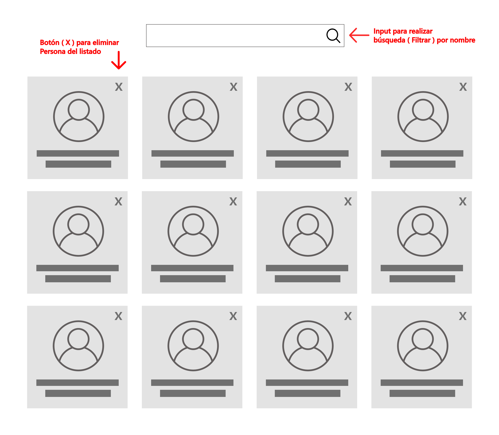

# prueba ecomsur con reactJS
- ## resultado

el desafio:
```
..
```

mi solucion:
```
npm install react-router-dom
npm install --save styled-components
material icons
axios
```


- ## etapas del desarrollo para esta prueba
    - ### detalles
        - [api a consumir](https://randomuser.me/api/?results=15)  
        - se adjunto wireframe de ejemplo pero el **diseño a libre elección**
          
        -  tecnologias 
            - react: { [HOOKS,STATES] }
        - cliente HTTP
        - AXIOS
    - ### informacion solicitada
        - README.md
            - explicacion de esta solucion con fundamentos
            - repo en git (adicionalmente lo dejo en [DEPLOY aqui](www.google.com) para facil acceso) 
    - ### objetivos de la APP
        - Mostrar un listado de las personas. 
        - Incluir un buscador por nombre
        - Un botón para eliminar personas del listado 


